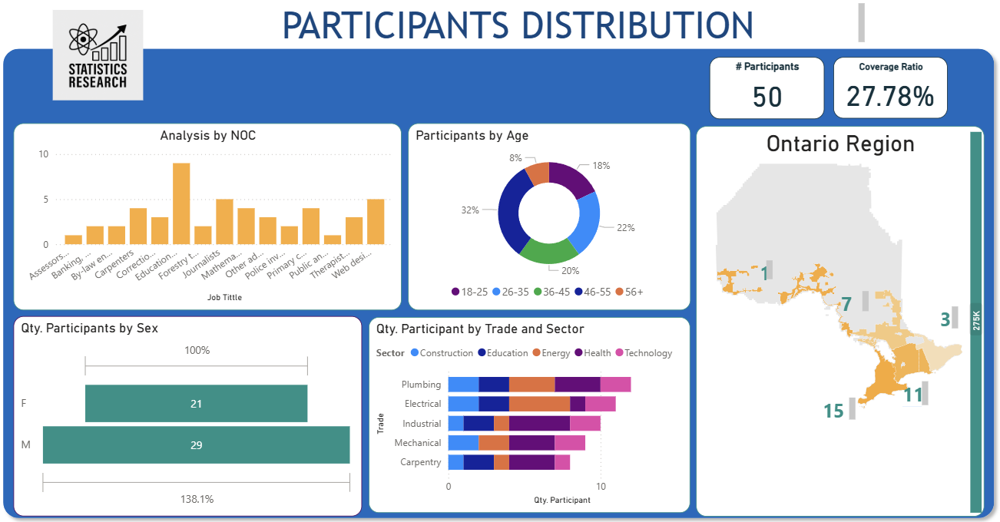

# Study Participant Dashboard

This project presents a visual summary of participants from a research study conducted across various regions of Ontario. It includes demographic, occupational, and geographic insights, using both tabular and geospatial data.

## 📍 Dashboard Overview

The dashboard includes:

- Participant count and coverage ratio
- Distribution by age group and sex
- Occupation analysis by NOC code
- Trade and sector breakdown
- Regional distribution mapped via custom GeoJSON

A sample of the dashboard is shown below:



## 🌐 Geographic Data

The regional map was created using QGIS and exported as a GeoJSON file. The five Ontario regions represented are:

| Code | Region             |
|------|--------------------|
| CO   | Central Ontario    |
| SC   | South Central      |
| SW   | South West         |
| NW   | North West         |
| EO   | Eastern Ontario    |

This custom GeoJSON is linked to participant data using the `Code_Region` field.

## 🗂 Project Structure

```
Study-Participant-Dashboard/
├── data/                        # CSV and GeoJSON datasets
├── dashboard/                   # Power BI screenshots or PBIX file
├── docs/                        # GitHub Pages site
│   └── index.html
└── README.md
```

## 🔗 GitHub Pages

A snapshot version of the dashboard is available at:  
👉 [View Dashboard](https://paulamrez.github.io/Study-Participant-Dashboard/)

## 👩‍💻 Author

**Paula Ramirez**  
[LinkedIn](https://www.linkedin.com/in/paulamrz)  
paulamrz@outlook.com
